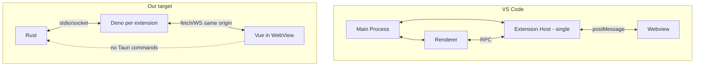

# VS Code Extension Architecture: Cross-Reference and Implications for Mars

## Purpose (expanded)

Iter 5 medium touch.

## Purpose

Cross-reference our extension/sandbox plan with how VS Code solves the same problems: extension ecosystem, security, sandboxing, frontend vs backend split, performance, and resource management. No code changes—analysis and recommendations only.

---

## 1. VS Code’s Process and Communication Model

### 1.1 Three (Plus One) Processes

| Process | Count | Runtime | Role |
|--------|--------|--------|------|
| **Main** | One (all windows) | Node.js, full OS access | App lifecycle, window creation, native APIs, IPC routing |
| **Renderer** | One per window | Chromium (sandboxed: no Node) | Workbench UI, DOM, user input |
| **Extension Host** | One local (plus optional remote/web) | Node.js | Runs all (local) extensions; no DOM access |
| **Webview** | Per webview | Chromium iframe-like context | Extension-owned UI; isolated, message-passing only |

Extension Host is **spawned** by the main process and connected over **MessagePort** (IPC). An **RPC protocol** runs on top of that channel so the renderer and extension host exchange structured calls (e.g. “run this command,” “return completions”) without sharing memory or DOM.

### 1.2 Data Flow (No Direct Frontend → Core)

- **Renderer ↔ Extension Host:** RPC over IPC. Renderer asks extension host for data; extension host computes and returns. Extensions never touch the DOM.
- **Extension ↔ Webview:** Only **postMessage**. Webview gets `acquireVsCodeApi()` (one-time) and can only `postMessage()` to the extension. Extension uses `webview.onDidReceiveMessage()` and `webview.postMessage()`. So the **frontend (webview) never talks to Main or Renderer**; it only talks to the extension (which runs in the Extension Host).
- **Main:** Orchestrates windows and process lifecycle; renderer and extension host delegate to it where needed (e.g. file dialogs).

So the “frontend” (webview) is forced through the extension: **Main/Renderer ↔ Extension Host ↔ Webview**. The webview has no direct path to core VS Code processes.

**Mapping to our goal:** Our “Rust → Deno → Vue → Deno → Rust” and “frontend can’t directly call Rust” matches this: Vue (like webview) should only talk to Deno (extension host); Deno talks to Rust (main). Capability “no Tauri commands” for the extension window enforces “no direct Rust” the same way webview has no direct Main/Renderer API.

---

## 2. Security: How VS Code Thinks About It

### 2.1 Trust and API Surface

- **Extension Host** has the **same permissions as VS Code** (full Node, file, network, spawn). So VS Code does **not** OS-sandbox the extension host; they rely on:
  - **Trust:** Marketplace signing, verified publishers, malware scanning, dynamic checks in a “clean room” VM.
  - **API surface:** Extensions are written against the **`vscode` namespace only**. They don’t get a raw `require('fs')` in the UI path; the extension host runs Node and implements the `vscode` API on top of it. So the *contract* is “you only get what we expose.”
- **Renderer:** With **process sandboxing** enabled, the renderer **cannot use Node.js**. Any system access goes through IPC to Main or Extension Host. That limits damage from renderer compromise.
- **Webview:** No Node, no direct VS Code APIs except the one-time `acquireVsCodeApi()` → `postMessage`. So webview is a pure message-passing boundary.

So: **isolation by process** (renderer vs extension host vs webview) + **constrained API** (vscode.* / postMessage) + **trust** (marketplace, signing). They do not rely on Deno-style permission flags for the desktop extension host.

### 2.2 Implications for Us

- We can adopt the same **API-surface** idea: extensions (Deno) only see our **protocol** (storage, fetch proxy, events). No raw filesystem or network beyond what we expose.
- We go **further** than VS Code on the backend by using **Deno (or Node) permission flags** so the extension process truly cannot touch the machine except via our channel. So: **process isolation + narrow protocol + runtime permissions**.
- Frontend (Vue): same idea as webview—no direct Rust; only messaging to Deno. We enforce via capability + CSP.

---

## 3. Frontend vs Backend: Who Does What

### 3.1 VS Code Split

- **Extension (backend):** Runs in Extension Host. Does file I/O, network, commands, language features, workspace logic. Sends *results* to the renderer via RPC (e.g. “here are the completions,” “here is the webview HTML”).
- **Renderer:** Displays the workbench, runs the RPC client, applies extension data to the DOM. Does **not** run extension code.
- **Webview:** Displays extension UI. Only communicates with the extension via postMessage. No access to workspace, files, or VS Code internals.

So “backend” = Extension Host (and Main for native); “frontend” = Renderer + Webview. The **render thread is not blocked by extension work** because extension work runs in another process (Extension Host). The only thing that can block the renderer is renderer code or heavy RPC handling; VS Code keeps RPC async and avoids doing heavy work in the renderer.

### 3.2 Our Mapping

- **Rust** = Main (lifecycle, process management, host API, real network via proxy).
- **Deno** = Extension Host (extension logic, our protocol server, talks to Rust).
- **Vue (WebView)** = Webview (extension UI; talks only to Deno).

We keep the render thread unblocked the same way: **heavy work in Deno, not in the WebView**. Vue should only do UI and send messages to Deno; Deno does I/O and talks to Rust. So our prior plan (Rust → Deno → Vue → Deno → Rust) is aligned with VS Code’s split.

---

## 4. Performance and Resource Management

### 4.1 What VS Code Does

- **Lazy activation:** Extensions declare **activation events** (e.g. `onLanguage:python`, `onCommand:myCommand`, `*` for startup). They are **loaded only when needed**. So many extensions can be installed without all running at once.
- **Single Extension Host:** All (local) extensions run in **one** Node process. Pros: lower memory and process count, one RPC pipe to renderer. Cons: **one CPU-bound or buggy extension can block the whole extension host** (single V8 thread). VS Code documents this and provides “Restart Extension Host” and Extension Bisect to find culprits.
- **Webview cost:** Docs say webviews are “resource heavy” and should be used sparingly. So they accept a tradeoff: flexibility vs. memory/CPU.
- **No hard process limits:** They don’t document strict CPU/memory caps per extension; they rely on isolation (separate process from renderer) and tooling (Process Explorer, profiling) to diagnose.

### 4.2 Observations and Possible Pivots

- **One host vs one process per extension:** We had proposed **one Deno process per extension**. VS Code uses **one host for all**.  
  - **Our model:** Better isolation (one bad extension doesn’t block others), clearer resource attribution, easier kill/restart per extension. Cost: more processes and memory.  
  - **VS Code model:** Fewer processes, simpler IPC (one channel to “the” extension host). Cost: shared thread, one extension can stall others.  
  **Recommendation:** For a smaller, controlled set of extensions and stronger isolation, **staying with one process per extension (Deno per extension)** is reasonable. If we ever need “100+ extensions” like VS Code, we could introduce a **shared extension host** (e.g. one Node/Deno process that loads many extensions) and accept the shared-thread tradeoff, or explore a hybrid (e.g. one host per “category” or per trust level).

- **Lazy loading:** We didn’t explicitly design **activation events**. We should: **load an extension (spawn Deno, serve Vue) only when first needed** (e.g. first window open, or first command), not at app startup. That keeps startup and memory under control.

- **Render thread:** Keep **all heavy work in Deno**. Vue should only: handle UI events, send messages to Deno, receive updates and render. No large sync work in the WebView. Deno does storage, network (via Rust), and computation.

---

## 5. How VS Code Keeps the Frontend Render Thread From Being Blocked

- **Extension work is in another process.** So extension CPU work doesn’t block the renderer’s event loop.
- **RPC is async.** Renderer doesn’t block waiting on extension host; it uses async calls and callbacks.
- **Webview is isolated.** Webview script runs in its own context; a busy webview can affect its own frame but not the main workbench (and VS Code can dispose of the webview if needed).
- **No Node in renderer (with sandbox).** So renderer code can’t do blocking file/network in the main thread.

For us: **Deno in a separate process** gives the same “extension work off the render thread” guarantee. Vue (in WebView) must stay thin: async messaging to Deno, no long sync loops or heavy computation in the frontend.

---

## 6. Resource and Lifecycle

- **Extension Host crash:** VS Code offers “Developer: Restart Extension Host.” All extensions in that host restart. With **one Deno per extension**, we can **restart only that extension’s process** without affecting others.
- **Memory:** VS Code doesn’t enforce per-extension limits; they rely on V8 and user tooling. We could later add **Rust-side limits** (e.g. kill Deno if memory > N) or **Deno flags** to cap memory.
- **CPU:** No built-in throttling in VS Code. We could explore OS-level (e.g. nice, cgroups) or periodic health checks and restart if an extension host is stuck.

---

## 7. Summary: Alignments and Pivots

### Alignments (keep)

- **Rust → Deno → Vue → Deno → Rust** and **no direct frontend → Rust** match VS Code’s “webview only talks to extension; extension talks to core.”
- **Narrow API surface** (our protocol = storage, fetch, events) matches VS Code’s `vscode`-only surface.
- **Separate process for “backend” extension logic** keeps the render thread free; we do that with Deno.
- **Capability for extension window = no Tauri commands** enforces “frontend can’t call Rust” like webview having no Main/Renderer API.

### Pivots / Additions to Consider

1. **Lazy activation:** Load extension (spawn Deno, serve Vue) on first use (e.g. first open or first command), not at startup. Reduces startup time and memory when many extensions are installed.
2. **One host vs one per extension:** Keep **one Deno per extension** for isolation and per-extension restart; revisit a shared host only if we need VS Code–scale extension count and accept shared-thread tradeoffs.
3. **Explicit “Restart extension”:** Offer a way to restart a single extension’s Deno process (and optionally reload its Vue) for stability and debugging.
4. **Webview discipline:** Document that extension UIs (Vue) must stay thin: only UI + messaging to Deno; no heavy work in the WebView.
5. **Optional hardening:** Consider memory/CPU limits or health checks per Deno process later, rather than in v1.

---

## 8. Diagram (VS Code vs Our Target)

---

## 9. References

- [Extension Host | VS Code API](https://code.visualstudio.com/api/advanced-topics/extension-host)
- [Extension runtime security | VS Code Docs](https://code.visualstudio.com/docs/editor/extension-runtime-security)
- [Webview API | VS Code API](https://code.visualstudio.com/api/extension-guides/webview)
- [Web Extensions | VS Code API](https://code.visualstudio.com/api/extension-guides/web-extensions)
- [Activation Events | VS Code API](https://code.visualstudio.com/api/references/activation-events)
- [VS Code Internals: Extension Host (Roopik)](https://roopik.com/blog/vscode-internals-extension-host)
- [VS Code Internals: Three-Process Model (Roopik)](https://roopik.com/blog/vscode-internals-architecture-101)
- [Migrating VS Code to Process Sandboxing (blog)](https://code.visualstudio.com/blogs/2022/11/28/vscode-sandbox)
- [Explain extension causes high CPU load (vscode wiki)](https://github.com/microsoft/vscode/wiki/Explain-extension-causes-high-cpu-load)
