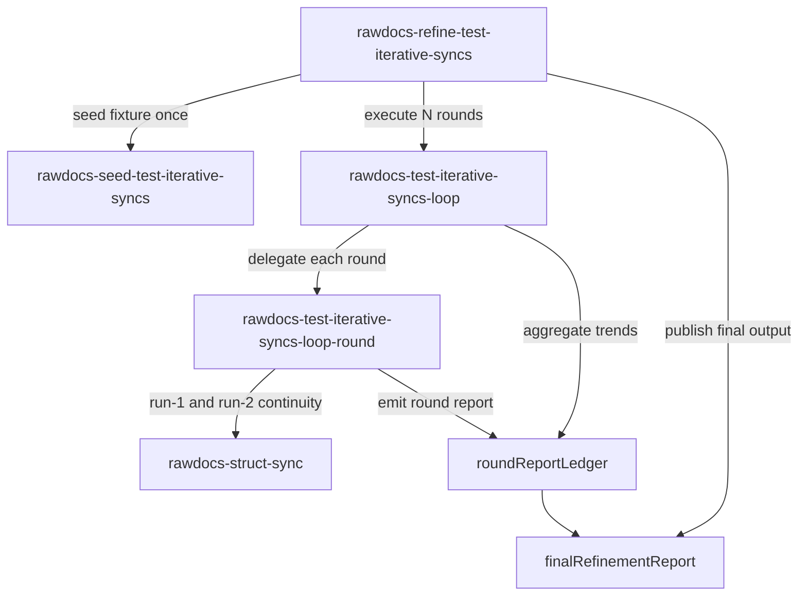
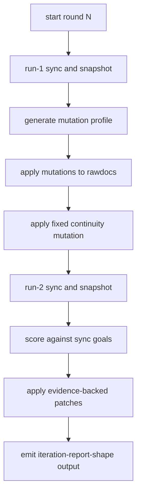

# Flow — refine test iterative syncs

This document captures purpose, execution plan, handoffs, and reporting flow for the iterative sync refinement system.

## Purpose

The workflow exists to improve `rawdocs-struct-sync` quality through repeatable evidence-led rounds that:

- preserve source meaning
- improve continuity and subtractive behavior
- improve bucket placement quality against policy goals

## Execution contract

1. `rawdocs-refine-test-iterative-syncs` orchestrates and reports.
2. `rawdocs-seed-test-iterative-syncs` owns fixture reset/seed lifecycle.
3. `rawdocs-test-iterative-syncs-loop` owns strict full-budget loop sequencing.
4. `rawdocs-test-iterative-syncs-loop-round` owns one complete round.

`TARGET_PLUGIN_PATH` is fixed to `.clank/plugins/_rawdocs-refine-test-iterative-syncs`.

## Architecture flow

## Round lifecycle

## Guardrails

- Strict full-budget mode: execute all requested rounds.
- No pause-mode controls.
- No script-generated loop runners (`.py`, `.js`, `.sh`, or equivalent).
- No fixture recreation inside loop rounds.
- Patch decisions must cite observed failure signatures.

## Required outputs

- per-round report stream using `iteration-report-shape.md`
- cumulative trend summary
- patch ledger with signature linkage
- next-cycle recommendations
