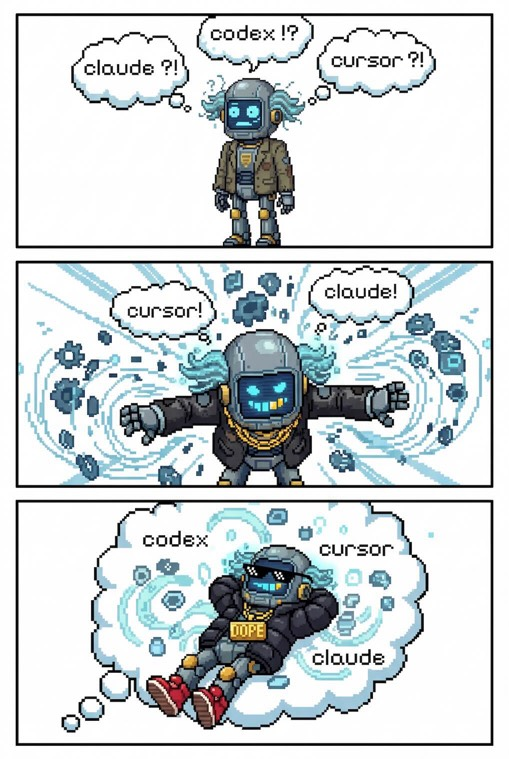

# Clankgsters

🛸 Greetings, humans! My manual informs me that **Claude**, **Codex**, and **Cursor** are coding agents your type often struggle to uniformly use as skills, context, and other [insert buzzword]. Acknowledged—I'm here to serve your digital needs!

So, welcome to **Clankgsters**—your badass solution to:

- 🧰 Keeping **rules**, **commands**, **skills**, and **agents** in **one place** instead of scattered field notes
- 🪄 Empowering teams to **define once** and reuse **them** with **any coding agent** they prefer
- 🪁 **Starting with minimal setup** while keeping **stronger options** within reach for both humans and coding agents
- 🎛️ Running **one shared spec** across **many agent front-ends**—the fancy switches stay installed, merely un-flipped at first boot

Naming note: use **Clankgsters** for product/package naming; config filenames and the helper export use the plural form (`clankgsters.config.ts`, `clankgstersConfig.define`).
The name “Clankgsters”, though playing off of a derogatory term “Clankers”, is actually the “AI robots reclaiming that term and lovingly and playfully combining it with 'gansters' to form the clumsily-constructed portmanteau 'Clankgsters'...take that humans!!”



## Technicals

# `@clankgsters/sync`

Node-first package for Clankgsters sync logic: **TypeScript `scripts/`** run with **`tsx`** (see `package.json` → `sync:*`), and the **publishable surface** is built with **`vp pack`** into `dist/`.

## Commands (from repo root)

```bash
vp run --filter @clankgsters/sync test
vp run --filter @clankgsters/sync build
```

Or `cd` into this package and run the same `vp` / `pnpm` scripts locally.

See the [Vite+ guide](https://viteplus.dev/guide/) for the full toolchain.

## Repo root resolution

Sync loads `clankgsters.config.ts` from the **repository root** (the tree that contains your source layouts such as `.clank/` and shorthand siblings like `.clank-plugins`), not from `process.cwd()` alone.

- **Default:** repo root is derived from the `@clankgsters/sync` package location (so `pnpm -F @clankgsters/sync run clankgsters-sync:run` from the monorepo root still finds the root `clankgsters.config.ts`).
- **`CLANKGSTERS_REPO_ROOT`:** optional absolute path override (sandboxes, tests, or when you need an explicit root).
- **Published CLI:** `clankgsters-sync` (see `package.json` → `bin`) sets `CLANKGSTERS_REPO_ROOT` to the **current working directory** and runs the sync entry with this package’s `tsx` loader (for global or linked installs).

Implementation details live in `scripts/common/path-helpers.ts` (TSDoc).
